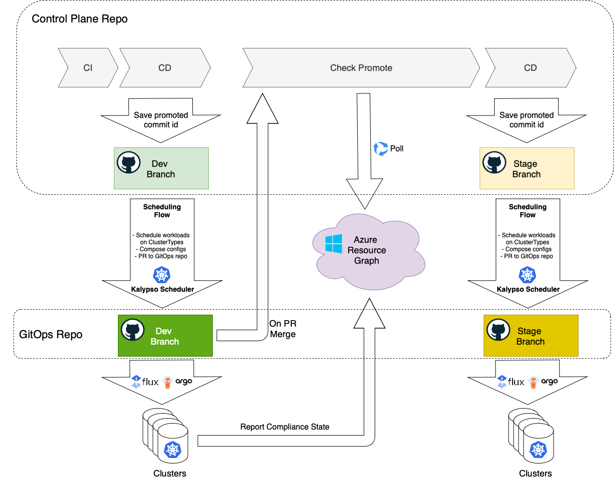

# Kalypso Control Plane

This is where platform team “models” the fleet. This repository is supposed to be human oriented, easy to understand, update, and review.  It has branches that represent environment stages. 

## Control Plane Abstractions

This repository operates with the abstractions like `Cluster Type`, `Reconciler`, `Template`, `Config`, `Workload`, `Workload Registration`, `Deployment Target` and `Scheduling Policy`.

Refer to the full list of abstractions in the [Kalypso Scheduler](https://github.com/microsoft/kalypso-scheduler#kalypso-control-plane-abstractions) repository.

## Repository structure

The *Control Plane* repository contains two types of data:

- The data that is about to be promoted across environments. It lives in *main* branch and consists of:
  - Onboarded *Workload Registrations*
  - *Templates*
- Environment specific configurations. This data is not promoted as it is specific for each environment. It lives in the corresponding environment branches (e.g. dev, qa, prod) and consists of: 
  - *Cluster Types* included in the environment
  - *Configs*
  - *Scheduling Policies*

This branching structure is the only requirement for this repo. The folder structure within the branches is totally open. You can group abstractions and organize them in the folder hierarchies on your own preference.   

## Promotional Flow

Kalypso Control Plane repository implements the [promotional flow](https://github.com/microsoft/kalypso#promotion-and-scheduling) with a chain of GitHub Actions Workflows:

### CI 

The CI workflow is triggered on a commit to the *main* branch. It contains a placeholder to perform some quality and security checks and invokes the [CD](#cd) workflow to promote the change to the first environment in the chain (e.g. *Dev*).

The workflow updates the Git commit status with the result of the CI process.

### CD

The CD workflow promotes the change to the environment by saving the *main* branch commit id to `base-repo.yaml` file in the environment branch. This event starts the scheduling and transformation flow that ends up with a PR to the GitOps repository. 

The workflow updates the Git commit status specifying that the change has been promoted to the environment.

### Check Promote

Merging of the PR to the GitOps repository starts the Check Promote workflow in the control plane repository. This workflow polls Azure Resource Graph, waiting until all registered [GitOps configurations](https://learn.microsoft.com/en-us/azure/azure-arc/kubernetes/conceptual-gitops-flux2) in the subscription are in compliance with the last PR to the GitOps repository.

If one of the clusters reports failure, the workflow fails. It reports the failure Git commit status and the whole promotion flow stops.

Once all configurations are compliant, the workflow runs a placeholder for the post-deployment activities, such as automated testing and reports to the Git commit status the fact of the successful deployment to the environment. 

At the end, the workflow invokes the [CD](#cd) workflow to promote the change in the *main* branch to the next environment (e.g. *Stage*). The whole process stops when there is no next environment in the chain.    

## Contributing

This project welcomes contributions and suggestions.  Most contributions require you to agree to a
Contributor License Agreement (CLA) declaring that you have the right to, and actually do, grant us
the rights to use your contribution. For details, visit https://cla.opensource.microsoft.com.

When you submit a pull request, a CLA bot will automatically determine whether you need to provide
a CLA and decorate the PR appropriately (e.g., status check, comment). Simply follow the instructions
provided by the bot. You will only need to do this once across all repos using our CLA.

This project has adopted the [Microsoft Open Source Code of Conduct](https://opensource.microsoft.com/codeofconduct/).
For more information see the [Code of Conduct FAQ](https://opensource.microsoft.com/codeofconduct/faq/) or
contact [opencode@microsoft.com](mailto:opencode@microsoft.com) with any additional questions or comments.

## Trademarks

This project may contain trademarks or logos for projects, products, or services. Authorized use of Microsoft 
trademarks or logos is subject to and must follow 
[Microsoft's Trademark & Brand Guidelines](https://www.microsoft.com/en-us/legal/intellectualproperty/trademarks/usage/general).
Use of Microsoft trademarks or logos in modified versions of this project must not cause confusion or imply Microsoft sponsorship.
Any use of third-party trademarks or logos are subject to those third-party's policies.
